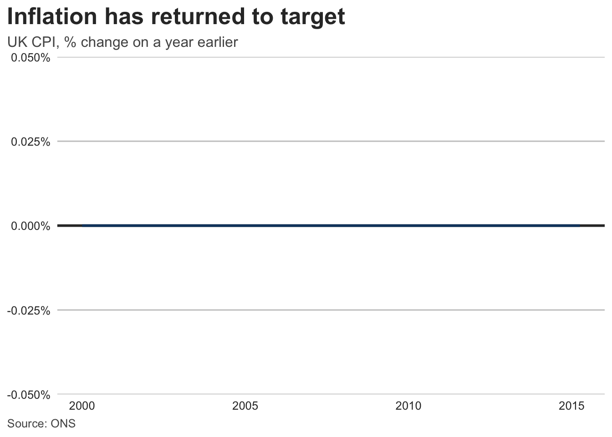

# Implementation: R / ggplot2 / Quarto

Maps the standard onto a ggplot2 (≥ 4.0) + Quarto stack. The normative rules live in documents 01–05; this file shows one conforming implementation. Patterned on the BBC’s `bbplot`/cookbook approach.

## 1 Palettes as constants

``` r
library(ggplot2)

# 03-color-palettes.qmd — categorical default (UK Analysis Function order)
palette_categorical <- c(
  "#12436D",
  "#28A197",
  "#801650",
  "#F46A25",
  "#3D3D3D",
  "#A285D1"
)

# Okabe–Ito alternative (also available as grDevices::palette.colors(palette = "Okabe-Ito"))
palette_okabe_ito <- c(
  "#000000",
  "#E69F00",
  "#56B4E9",
  "#009E73",
  "#F0E442",
  "#0072B2",
  "#D55E00",
  "#CC79A7"
)

palette_sequential <- c(
  "#F2F2F2",
  "#ADD1F1",
  "#6BACE6",
  "#2073BC",
  "#12436D",
  "#092135"
)

palette_highlight <- c(highlight = "#12436D", context = "#BFBFBF")

color_text <- "#333333"
color_text_soft <- "#555555"
color_gridline <- "#CBCBCB"
color_baseline <- "#333333"
```

## 2 Theme (P-4, TY-2/3/7/8)

``` r
theme_report <- function(base_size = 12) {
  ggplot2::theme_minimal(base_size = base_size) +
    ggplot2::theme(
      # finding-first title block, left-aligned to the plot edge (TY-2)
      plot.title.position = "plot",
      plot.title = ggplot2::element_text(face = "bold", size = base_size * 1.6),
      plot.subtitle = ggplot2::element_text(color = color_text_soft),
      plot.caption = ggplot2::element_text(color = color_text_soft, hjust = 0),
      plot.caption.position = "plot",
      # y gridlines only, light grey (P-4, TY-7)
      panel.grid.major.x = ggplot2::element_blank(),
      panel.grid.minor = ggplot2::element_blank(),
      panel.grid.major.y = ggplot2::element_line(color = color_gridline),
      axis.title = ggplot2::element_blank(), # units go in the subtitle (TY-11)
      axis.text = ggplot2::element_text(color = color_text),
      # legend top, no title; prefer direct labels anyway (TY-6)
      legend.position = "top",
      legend.title = ggplot2::element_blank(),
      text = ggplot2::element_text(color = color_text)
    )
}
```

## 3 Scales

``` r
scale_color_report <- function(...) {
  ggplot2::scale_color_manual(values = palette_categorical, ...)
}

scale_fill_report <- function(...) {
  ggplot2::scale_fill_manual(values = palette_categorical, ...)
}

# Sequential/continuous: viridis is a conforming perceptually-uniform default
# (03 — sequential): ggplot2::scale_fill_viridis_c()
```

## 4 A conforming chart

``` r
# Use economics dataset and compute a rate-like variable for demonstration
inflation <- data.frame(
  date = economics$date[economics$date >= as.Date("2000-01-01")],
  rate = (economics$pce[economics$date >= as.Date("2000-01-01")] /
    lag(economics$pce[economics$date >= as.Date("2000-01-01")], 12) -
    1) *
    100
)

plot_inflation <- inflation |>
  ggplot(aes(date, rate)) +
  geom_hline(yintercept = 0, linewidth = 1, color = color_baseline) + # TY-8
  geom_line(linewidth = 1, color = palette_categorical[[1]]) + # AX-11
  scale_y_continuous(labels = scales::label_percent(scale = 1)) +
  labs(
    title = "Inflation has returned to target", # P-2: the finding
    subtitle = "UK CPI, % change on a year earlier", # TY-1: measure + unit
    caption = "Source: ONS" # P-7 / TY-15
  ) +
  theme_report()
```

Highlight-vs-context pattern (CO-5, CT-A7): map the featured series to `palette_highlight[["highlight"]]` and all others to `palette_highlight[["context"]]`, then label directly with `geom_text()` / `ggrepel` instead of a legend.

Small multiples (CT-3): `facet_wrap(vars(category))` with fixed scales unless a documented reason requires `scales = "free_y"`.

## 5 Quarto integration

- **Alt text (AX-6/7)** — every figure chunk sets `fig-alt`:

  ``` r
  plot_inflation
  ```

  

- **HTML-native titles (TY-5, AX-8)** — for web output, prefer the page’s heading and lead paragraph to carry title/context, and emit SVG: `knitr: opts_chunk: dev: "svglite"`.

- **Theme discipline** — define `theme_report()`, palettes, and scale helpers once in a sourced `R/theme.R` (or an internal package), never inline per chunk; set `ggplot2::theme_set(theme_report())` in a setup chunk.

- **Brand** — a `_brand.yml` can carry the palette for non-ggplot outputs (tables, value boxes) so HTML components and charts share hex codes.

## 6 Verification helper

Contrast checking (AX-1/2) without leaving R:

``` r
contrast_ratio <- function(fg, bg = "#FFFFFF") {
  lum <- function(hex) {
    rgb <- grDevices::col2rgb(hex)[, 1] / 255
    lin <- ifelse(rgb <= 0.03928, rgb / 12.92, ((rgb + 0.055) / 1.055)^2.4)
    sum(lin * c(0.2126, 0.7152, 0.0722))
  }
  l <- sort(c(lum(fg), lum(bg)), decreasing = TRUE)
  (l[[1]] + 0.05) / (l[[2]] + 0.05)
}

palette_categorical |> purrr::map_dbl(contrast_ratio) # all >= 3
```

    [1] 10.246867  3.165013  9.774534  3.028141 10.862247  3.082805

Colorblind simulation: `colorblindr::cvd_grid(plot_inflation)` or `colorspace::simulate_cvd()`.
