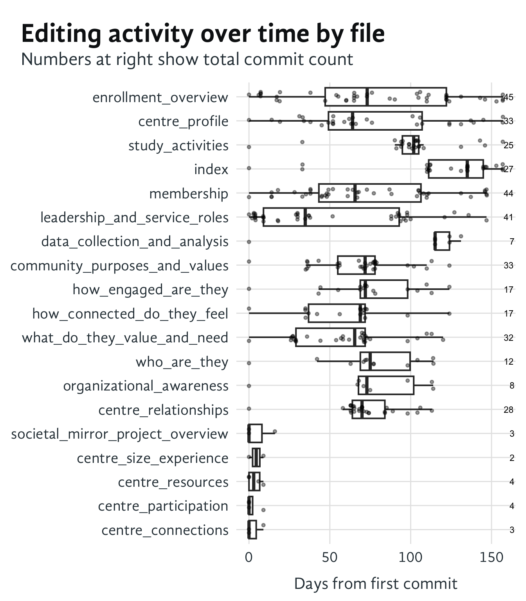
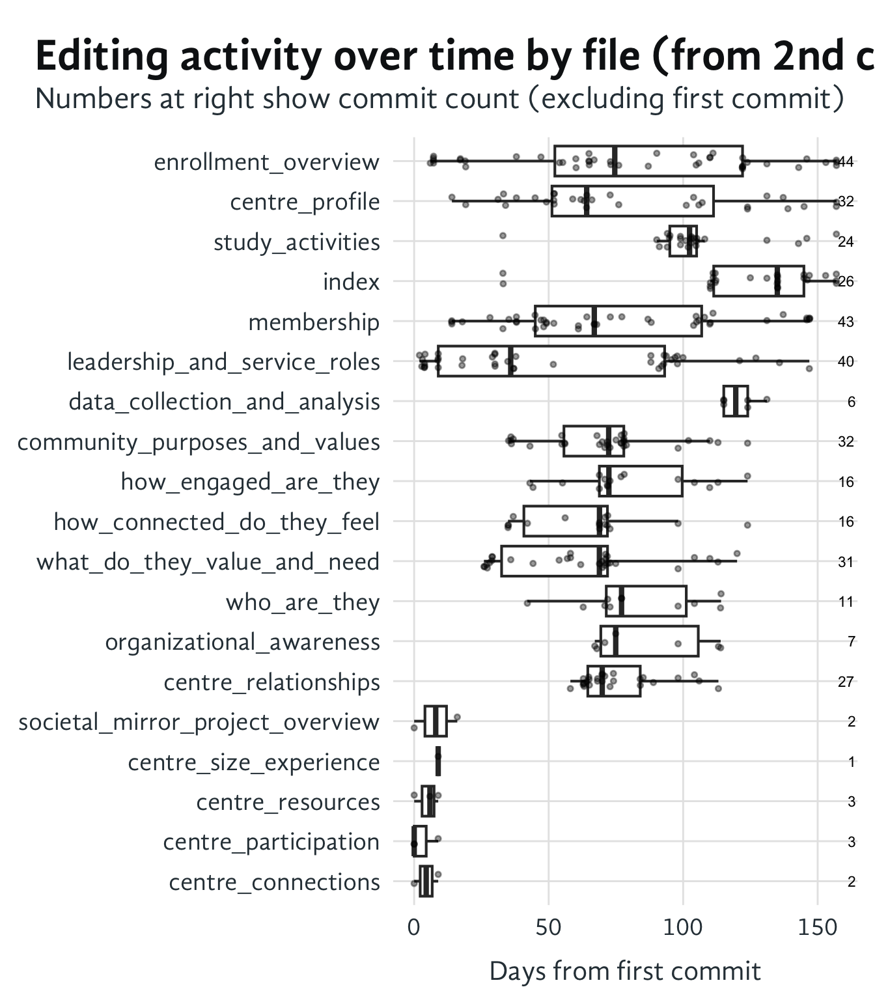
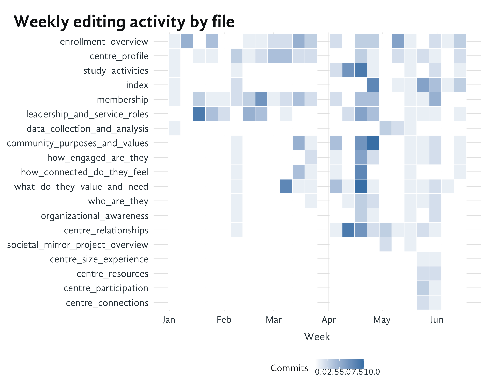

# Page Edit History Analysis

The data on this page comes from the commit history of the Quarto files in Societal Mirror repository. The analysis focuses on the editing activity for each page, including the number of commits, the time span of edits, and temporal patterns of page development.

## 1 Editing Activity by Page Name

Figure 1: Editing activity over time for each file, sorted by total editing span. Numbers at right show total commit count.

Each file was set up early in the process, but the editing activity varies widely. Work on some files began immediately, and other waited for a while. The boxplots show the distribution of editing days for each file, with jittered points representing individual commits.

The files are sorted by their editing span (max days from first commit), with commit counts displayed on the right. `enrollment_overview` has been the most actively maintained page with the longest editing history (157 days) and the most commits (45), followed by `centre_profile` (33 commits over 157 days) and `study_activities` (25 commits over 153 days). The newer pages at the bottom like `centre_connections`, `centre_participation`, and `centre_resources` have shorter histories (under 10 days) and fewer commits (2-4).

Interestingly, `data_collection_and_analysis` was created early but only recently received its 7 commits around day 140, showing a different pattern of intermittent maintenance.

## 2 Post-Creation Maintenance Pattern

Figure 2: Editing activity from the 2nd commit onward, excluding initial creation commit

This view focuses on ongoing maintenance patterns by excluding the initial creation commit. The commit counts are reduced by 1 for each file, showing only post-creation edits. Some files like `centre_size_experience` only have 1 commit after creation, indicating they’ve been relatively stable since their initial setup.

## 3 Temporal Editing Patterns

Figure 3: Weekly editing activity heatmap showing when each file received edits

The heatmap reveals distinct editing patterns across time:

- **enrollment_overview** and **centre_profile** show the most sustained activity, with edits spread throughout January-June
- Several files had concentrated bursts of activity in specific periods (e.g., **study_activities** in mid-April, **leadership_and_service_roles** in January-February)
- Most newer files at the bottom only appear in the June timeframe
- Some weeks saw intensive editing across multiple files, particularly in late May/early June
- **data_collection_and_analysis** shows a gap from creation until recent activity in May-June
