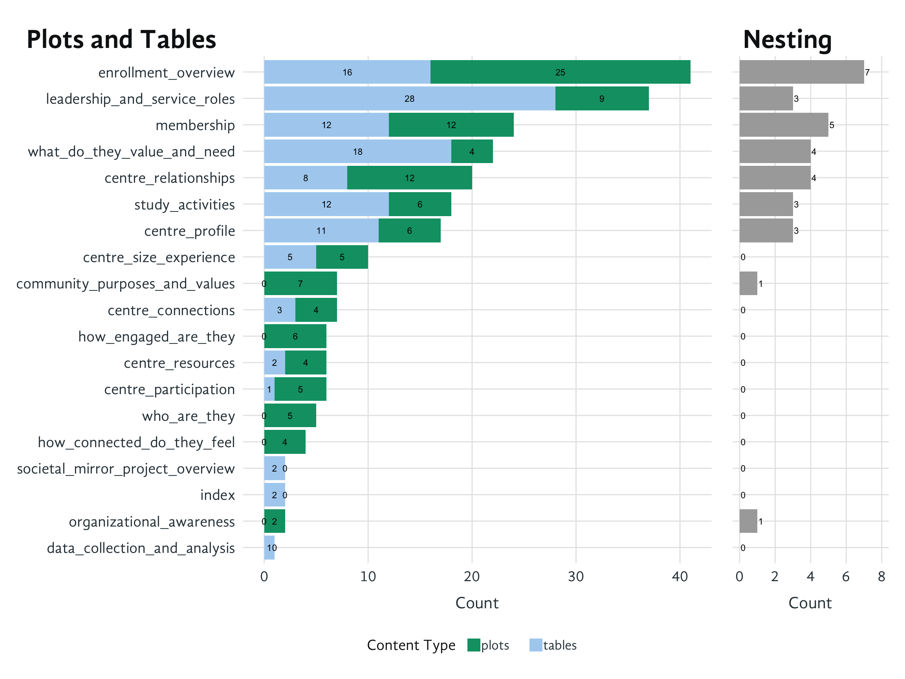

# Website profile

This page shows the content structure of the Societal Mirror website, analyzing each page by the number of plots, tables, and tabset panels it contains. This helps us understand the complexity and layout patterns across the site.

## 1 Content Analysis

The visualization below shows two key dimensions of content complexity:

- **Plots and Tables**: The left panel shows the distribution of visual and tabular content across pages, with plots in green and tables in blue. Pages are sorted by total content count.
- **Nesting**: The right panel indicates the number of tabset panels on each page, which reflects organizational complexity and information hierarchy.

